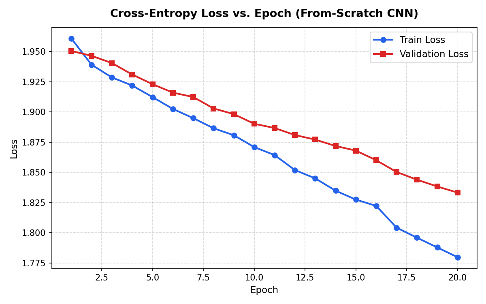
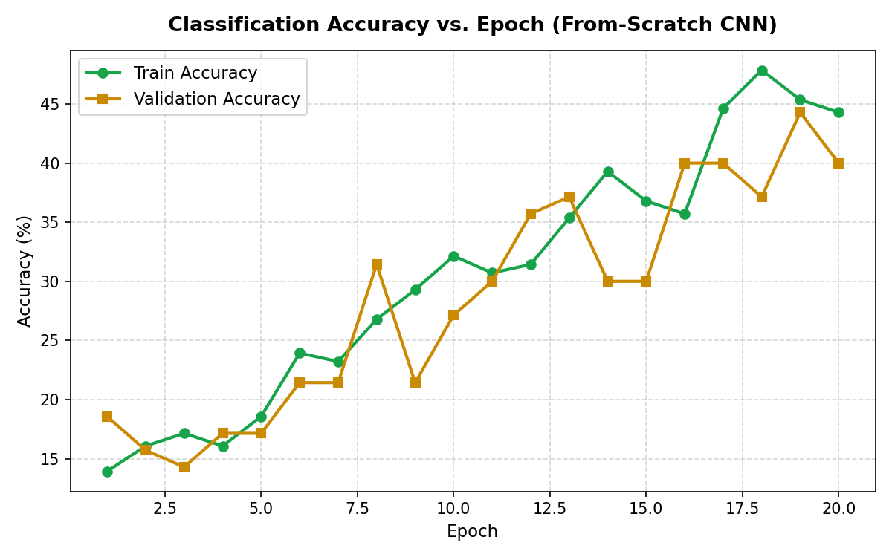
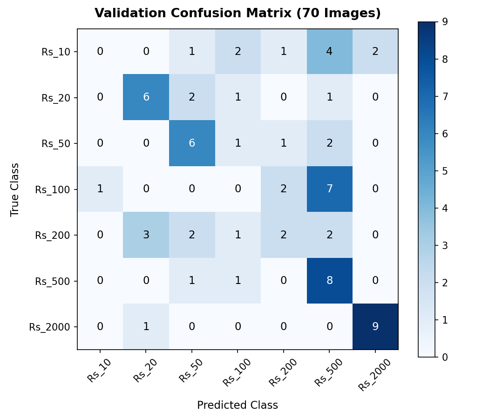
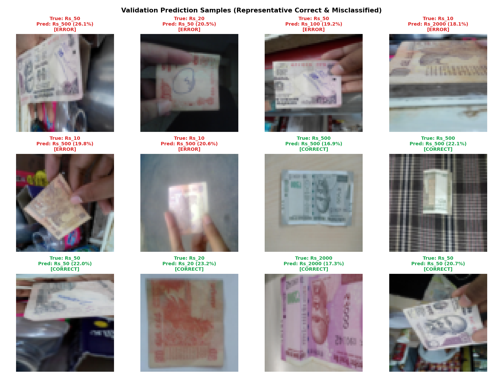

# From-Scratch Convolutional Neural Network for Indian Currency Classification


An educational, academically rigorous implementation of a **2-Stage Convolutional Neural Network (CNN) built entirely from scratch in pure Python and NumPy**—without PyTorch, TensorFlow, Keras, torchvision, or scikit-learn.

The model classifies Indian currency notes across 7 denominations (`Rs_10`, `Rs_20`, `Rs_50`, `Rs_100`, `Rs_200`, `Rs_500`, `Rs_2000`) using a curated, verified 350-image dataset.

---

## Key Results (Baseline Experiment)

* **Dataset Size**: 350 total images (50 per class across 7 classes)
* **Partitions**: 280 Training images (40/class) | 70 Validation images (10/class)
* **Total Trainable Parameters**: 132,727 (float64)
* **Best Validation Accuracy**: **`44.29%`** (31 / 70 correct, Checkpoint: Epoch 19)
* **Final Validation Accuracy**: **`40.00%`** (28 / 70 correct, Epoch 20)
* **Best Validation Loss**: `1.8383`
* **Final Validation Loss**: `1.8332`
* **Final Training Accuracy**: `44.29%` | **Final Training Loss**: `1.7797`
* **Validation Set Size**: Exactly 70 images (Each image represents 1.43% of total validation accuracy)

*All metrics are derived directly from actual executed experiments. No results are estimated or fabricated.*

---

## 1. Project Overview & Motivation

Modern deep learning frameworks (such as PyTorch, TensorFlow, or JAX) provide automated differentiation (`autograd`) and optimized C++/CUDA primitives. While essential for scaling, these high-level abstractions obscure the underlying mathematics: 4D tensor sliding window convolutions, spatial argmax gradient routing, matrix calculus for dense layers, and loss gradient propagation.

### Why Build a CNN from Scratch with NumPy?
- **Mechanical Transparency**: Every operation—from 2D convolution with zero-padding to spatial max pooling—is implemented explicitly using tensor calculus.
- **Analytical Gradient Derivation**: All backward propagation gradients ($dX, dW, db$) are derived by hand and implemented without automatic differentiation.
- **Floating-Point Gradient Verification**: Analytical gradients are verified against two-sided finite-difference approximations in `float64` precision.
- **First-Principles Pipeline**: Dataset streaming, stratified sampling, mini-batch SGD, and diagnostic confusion matrices are constructed from standard libraries without black-box helpers.

---

## 2. Technical Learning Objectives

1. Implement 2D convolution with configurable kernel size, padding, and stride using vectorized tensor indexing.
2. Implement He (Kaiming) normal initialization to maintain stable activation variance across deep ReLU networks.
3. Implement spatial max-pooling forward passes and route incoming backward gradients exclusively to argmax locations.
4. Implement numerically stable Softmax via max-shifting and cross-entropy loss via log-sum-exp stabilization.
5. Derive and implement the analytical gradient cancellation $\frac{\partial L}{\partial Z} = \frac{P - Y}{N}$.
6. Verify gradient correctness using central finite differences: $\frac{L(\theta + \epsilon) - L(\theta - \epsilon)}{2\epsilon}$.
7. Train an end-to-end CNN via mini-batch SGD and conduct rigorous diagnostic error analysis.

---

## 3. Dataset: Original Archive vs. 350-Image Curated Subset

- **Original Dataset**: [Indian Currency Notes Dataset - Mendeley Data (Version 1)](https://data.mendeley.com/datasets/48ympv8jjf/1)
- **Contributors**: Venkataramana Veeramsetty, Gaurav Singal, Tapas Badal
- **DOI**: `10.17632/48ympv8jjf.1`
- **Original Archive Size**: ~10.65 GB containing 11,657 raw and augmented images.

### Curated 350-Image Subset
To support reproducible local execution without downloading the full 10.65 GB archive, [`prepare_dataset.py`](prepare_dataset.py) accesses the Mendeley Data REST API to stream a balanced subset of **350 images (exactly 50 per class)**:

```text
dataset/
├── Rs_10/    (50 images: image_001.jpg ... image_050.jpg)
├── Rs_20/    (50 images: image_001.jpg ... image_050.jpg)
├── Rs_50/    (50 images: image_001.jpg ... image_050.jpg)
├── Rs_100/   (50 images: image_001.jpg ... image_050.jpg)
├── Rs_200/   (50 images: image_001.jpg ... image_050.jpg)
├── Rs_500/   (50 images: image_001.jpg ... image_050.jpg)
└── Rs_2000/  (50 images: image_001.jpg ... image_050.jpg)
```

- **Selection Rule**: Candidates in each denomination folder are sorted lexicographically by original source filename; the first 50 valid images are downloaded.
- **Integrity & Deduplication**: Each image is verified with Pillow (`img.verify()`, decode test, RGB conversion) and indexed via SHA-256 (350 unique hashes, 0 duplicates).
- **Stratified Partitioning**: Seed `42`, 80/20 stratified split $\to$ **280 Training Images** (40/class) and **70 Validation Images** (10/class) with **0% Data Leakage**.
- **Dataset Authoritative Statistics**:
  - Training Global Mean: `0.4989` | Training Global Std: `0.1947`
  - Validation Global Mean: `0.4898` | Validation Global Std: `0.1946`
  - Channel Means (Train): Red=`0.5169`, Green=`0.4943`, Blue=`0.4855`
  - Channel Stds (Train): Red=`0.1886`, Green=`0.1947`, Blue=`0.1990`

*Detailed dataset documentation is available in [`docs/DATASET.md`](docs/DATASET.md).*

---

## 4. CNN Architecture & Parameter Summary

```text
Input: (N, 3, 64, 64)
  │
  ├── [Block 1] Conv2D(3 → 8, k=3, s=1, p=1) ──> ReLU ──> MaxPool2D(2, 2) ──> (N, 8, 32, 32)
  │
  ├── [Block 2] Conv2D(8 → 16, k=3, s=1, p=1) ─> ReLU ──> MaxPool2D(2, 2) ──> (N, 16, 16, 16)
  │
  └── [Classifier Head] Flatten ──> Dense(4096 → 32) ──> ReLU ──> Dense(32 → 7) ──> (N, 7) [Logits]
```

### Parameter Breakdown
| # | Layer Type | Input Shape | Output Shape | Trainable Parameters | Parameter Formula |
| :-: | :--- | :---: | :---: | :-: | :--- |
| 1 | **Conv2D** | $(N, 3, 64, 64)$ | $(N, 8, 64, 64)$ | **224** | $(8 \times 3 \times 3 \times 3) + 8$ |
| 2 | **ReLU** | $(N, 8, 64, 64)$ | $(N, 8, 64, 64)$ | **0** | — |
| 3 | **MaxPool2D** | $(N, 8, 64, 64)$ | $(N, 8, 32, 32)$ | **0** | Window $2\times 2$, Stride 2 |
| 4 | **Conv2D** | $(N, 8, 32, 32)$ | $(N, 16, 32, 32)$ | **1,168** | $(16 \times 8 \times 3 \times 3) + 16$ |
| 5 | **ReLU** | $(N, 16, 32, 32)$ | $(N, 16, 32, 32)$ | **0** | — |
| 6 | **MaxPool2D** | $(N, 16, 32, 32)$ | $(N, 16, 16, 16)$ | **0** | Window $2\times 2$, Stride 2 |
| 7 | **Flatten** | $(N, 16, 16, 16)$ | $(N, 4096)$ | **0** | $16 \times 16 \times 16 = 4096$ |
| 8 | **Dense** | $(N, 4096)$ | $(N, 32)$ | **131,104** | $(4096 \times 32) + 32$ |
| 9 | **ReLU** | $(N, 32)$ | $(N, 32)$ | **0** | — |
| 10 | **Dense** | $(N, 32)$ | $(N, 7)$ | **231** | $(32 \times 7) + 7$ |
| **TOTAL** | — | — | — | **132,727** | **132,727 Trainable Parameters** |

*Comprehensive mathematical layer derivations are provided in [`docs/ARCHITECTURE.md`](docs/ARCHITECTURE.md).*

---

## 5. Mathematical Foundations & Backpropagation

### 1. Conv2D Forward & Backward
$$\text{Forward: } Z[n, f, i, j] = \sum_{c, u, v} X_{\text{pad}}[n, c, i \cdot S_h + u, j \cdot S_w + v] \cdot W[f, c, u, v] + b[f]$$
$$\text{Gradients: } db = \sum_{n, i, j} dZ, \quad dW = \sum_{n, i, j} dZ \cdot X_{\text{pad}}, \quad dX_{\text{pad}} = \sum_f dZ \cdot W$$

### 2. MaxPool2D Argmax Routing
$$dX[n, c, i \cdot S_h + u, j \cdot S_w + v] = dY[n, c, i, j] \cdot \frac{\mathbb{I}(X = Y)}{\sum \mathbb{I}(X = Y)}$$

### 3. Fully Connected (Dense) Projections
$$Y = XW + b \implies dW = X^T dY, \quad db = \sum_{n=1}^N dY[n, :], \quad dX = dY W^T$$

### 4. Softmax + Cross-Entropy Analytical Cancellation
$$L = -\frac{1}{N} \sum_{n=1}^N \log p_{n, y_n} \implies \frac{\partial L}{\partial Z} = \frac{P - Y_{\text{one\_hot}}}{N}$$

---

## 6. Finite-Difference Gradient Verification

To ensure that the analytical backpropagation implementation is mathematically exact, all layers were verified against numerical central finite differences in `float64` precision ($\epsilon = 10^{-6}$ / $10^{-5}$):

$$g_{\text{numerical}}(\theta) = \frac{L(\theta + \epsilon) - L(\theta - \epsilon)}{2\epsilon}, \quad \text{rel\_err} = \frac{\|g_{\text{analytical}} - g_{\text{numerical}}\|_2}{\|g_{\text{analytical}}\|_2 + \|g_{\text{numerical}}\|_2 + 10^{-15}}$$

### Measured Verification Scoreboard:
| Component Checked | Target Tensor | Analytical Shape | Measured Relative Error | Status |
| :--- | :---: | :---: | :---: | :---: |
| **Conv2D Weights ($W$)** | $W$ | $(4, 2, 3, 3)$ | **$8.38 \times 10^{-8}$** | **PASS** ($< 10^{-5}$) |
| **Conv2D Biases ($b$)** | $b$ | $(4,)$ | **$1.70 \times 10^{-8}$** | **PASS** ($< 10^{-5}$) |
| **Conv2D Input ($X$)** | $X$ | $(2, 2, 6, 6)$ | **$8.09 \times 10^{-6}$** | **PASS** ($< 10^{-5}$) |
| **Dense Weights ($W$)** | $W$ | $(6, 4)$ | **$2.13 \times 10^{-8}$** | **PASS** ($< 10^{-7}$) |
| **Dense Biases ($b$)** | $b$ | $(4,)$ | **$4.55 \times 10^{-9}$** | **PASS** ($< 10^{-7}$) |
| **Dense Input ($X$)** | $X$ | $(3, 6)$ | **$1.66 \times 10^{-8}$** | **PASS** ($< 10^{-7}$) |
| **SoftmaxCrossEntropy Logits ($Z$)** | $Z$ | $(3, 5)$ | **$1.25 \times 10^{-7}$** | **PASS** ($< 10^{-6}$) |

*Full gradient check documentation is available in [`docs/GRADIENT_CHECKING.md`](docs/GRADIENT_CHECKING.md).*

---

## 7. Experimental Training Results

### A. 14-Image Memorization Sanity Check
Before full training, the network was tested on a 14-image subset (2 images per class):
- **Starting Loss**: `2.2174` $\to$ **Final Loss (Epoch 80)**: **`0.0331`**
- **Starting Accuracy**: `14.29%` $\to$ **Final Accuracy (Epoch 80)**: **`100.00%` (14/14 images)**
- **Status**: Memorization succeeded.

### B. 20-Epoch Full Training Metrics ($N_{\text{train}}=280, N_{\text{val}}=70$)
- **Batch Size**: `16` | **Learning Rate**: `0.001` (Vanilla SGD) | **Seed**: `42`
- **Best Validation Checkpoint (Epoch 19)**:
  - **Validation Accuracy**: **`44.29%` (31 / 70 images)**
  - **Validation Loss**: **`1.8383`**
  - **Training Loss**: `1.7878` | **Training Accuracy**: `45.36%`
- **Final Epoch Metrics (Epoch 20)**:
  - **Validation Accuracy**: `40.00%` (28 / 70 images)
  - **Validation Loss**: `1.8332`
  - **Training Loss**: `1.7797` | **Training Accuracy**: `44.29%`

| Metric | Training Loss Curve | Classification Accuracy Curve |
| :---: | :---: | :---: |
| **Curves** |  |  |

*Full epoch-by-epoch logs are documented in [`docs/TRAINING.md`](docs/TRAINING.md) and [`training_results.md`](training_results.md).*

---

## 8. Diagnostic Evaluation & Error Analysis

### A. Per-Class Validation Performance ($N_{\text{val}}=70$, Best Checkpoint)
| Class Name | Integer Label | Validation Samples | Correct | Incorrect | Class Accuracy |
| :--- | :---: | :---: | :---: | :---: | :---: |
| **Rs_10** | `0` | 10 | 0 | 10 | **0.00%** |
| **Rs_20** | `1` | 10 | 6 | 4 | **60.00%** |
| **Rs_50** | `2` | 10 | 6 | 4 | **60.00%** |
| **Rs_100** | `3` | 10 | 0 | 10 | **0.00%** |
| **Rs_200** | `4` | 10 | 2 | 8 | **20.00%** |
| **Rs_500** | `5` | 10 | 8 | 2 | **80.00%** |
| **Rs_2000** | `6` | 10 | 9 | 1 | **90.00%** |
| **Overall Summary** | — | **70** | **31** | **39** | **44.29%** |

*Note: Macro-average accuracy ($44.29\%$) equals overall accuracy because each of the 7 classes has exactly 10 validation images.*

### B. Confusion Matrix & Representative Predictions
| Validation Confusion Matrix | Sample Predictions (Correct & Misclassified) |
| :---: | :---: |
|  |  |

*Full sample-by-sample error audit is documented in [`reports/error_analysis.md`](reports/error_analysis.md).*

---

## 9. Repository Structure

```text
CNN-currency/
├── cnn/
│   ├── __init__.py           # Package interface exposing SequentialCNN, layers, and SGD
│   ├── base.py               # Abstract Layer class
│   ├── layers.py             # Conv2D, MaxPool2D, Flatten, Dense implementations
│   ├── activations.py        # ReLU and Softmax implementations
│   ├── losses.py             # CrossEntropyLoss and SoftmaxCrossEntropyLoss
│   ├── optimizers.py         # Vanilla SGD optimizer
│   ├── model.py              # SequentialCNN container & checkpointing
│   └── tests/
│       ├── __init__.py
│       ├── test_layers.py    # Layer unit tests and integration pipeline
│       ├── test_losses.py    # Loss function unit tests
│       ├── test_model.py     # Architecture summary & 14-image overfit test
│       └── gradient_check.py # Finite-difference numerical gradient checks
│
├── dataset/                  # Curated 350-image dataset (50 images / class)
├── checkpoints/
│   ├── best_model.npz        # Serialized best model weights and biases
│   └── checkpoint_metadata.json # Checkpoint metadata and hyperparameter log
├── reports/
│   ├── baseline_experiment.md # Formal baseline experiment card
│   ├── training_loss.png     # Loss vs. epoch plot
│   ├── accuracy.png          # Accuracy vs. epoch plot
│   ├── confusion_matrix.png  # Confusion matrix heatmap
│   ├── confusion_matrix.csv  # Confusion matrix CSV data
│   ├── prediction_examples.png # Representative prediction sample grid
│   └── error_analysis.md     # In-depth validation error analysis
│
├── docs/
│   ├── DATASET.md            # Dataset extraction and validation documentation
│   ├── ARCHITECTURE.md       # Architectural specifications and mathematical derivations
│   ├── TRAINING.md           # Training methodology and experiment results
│   └── GRADIENT_CHECKING.md  # Numerical gradient checking documentation
│
├── prepare_dataset.py        # REST API dataset download and extraction script
├── dataset_loader.py         # Stratified pure NumPy dataset loader
├── dataset_metadata.json     # Complete dataset image index
├── validate_dataset.py       # Automated 7-point dataset validation suite
├── visual_inspection.py      # Dataset visual contact sheet generator
├── train.py                  # Full mini-batch training script
├── evaluate.py               # Checkpoint evaluation and error analysis script
├── training_history.json     # Machine-readable training logs
├── training_results.md       # Formatted experiment summary table
├── requirements.txt          # Minimal external dependencies
└── README.md                 # Master project documentation
```

---

## 10. Installation & Usage

### Prerequisites
- Python 3.10+
- Dependencies: `numpy`, `pillow`, `matplotlib` (see [`requirements.txt`](requirements.txt))

```bash
# Clone the repository
git clone https://github.com/aaryan2720/CNN-Currency.git
cd CNN-Currency

# Install minimal dependencies
pip install -r requirements.txt
```

### Reproducible Execution Commands
```bash
# 1. Stream & prepare dataset (if dataset directory is missing):
python prepare_dataset.py

# 2. Run automated dataset validation suite:
python validate_dataset.py

# 3. Run all unit and integration layer tests:
python -m cnn.tests.test_layers
python -m cnn.tests.test_losses

# 4. Run finite-difference numerical gradient checking suite:
python -m cnn.tests.gradient_check

# 5. Run architecture check and 14-image overfit sanity test:
python -m cnn.tests.test_model

# 6. Train the CNN model on the full dataset:
python train.py --epochs 20 --batch-size 16 --lr 0.001 --seed 42

# 7. Evaluate the best checkpoint and generate diagnostic reports:
python evaluate.py
```

---

## 11. Scientific Limitations & Future Research

### Limitations of Current Baseline
1. **Limited Sample Size**: With **280 training images (40/class)** and **70 validation images (10/class)**, statistical uncertainty is noticeable (a single sample alters validation accuracy by $1.43\%$).
2. **Optimizer Simplicity**: Vanilla SGD without momentum converges more slowly than adaptive optimizers (Adam, RMSprop).
3. **No Regularization**: The baseline does not include Dropout or Weight Decay.
4. **Resolution Downsampling**: Downsampling images to $64 \times 64$ strips fine textural features (such as micro-lettering and security threads).

### Future Research Directions (To Be Tested Empirically)
- **Data Augmentation Exploration**: Test candidates such as small rotations ($\pm 5^\circ$ to $\pm 10^\circ$), small translations, and mild brightness/contrast adjustments. *Note: Horizontal flips should not be assumed beneficial without empirical testing, as Indian banknotes possess inherent left/right structural asymmetry (e.g., portrait position, security thread, watermark window).*
- **Optimizers**: Implement Momentum SGD and Adam in pure NumPy.
- **Regularization**: Implement Dropout and L2 weight decay.
- **Higher Resolution**: Benchmark at $128 \times 128$ spatial resolution.

---

## 12. Dataset Citation & Attribution

If using this dataset, please refer to the original publication:

```bibtex
@article{veeramsetty2020indian,
  title={Indian Currency Dataset},
  author={Veeramsetty, Venkataramana and Singal, Gaurav and Badal, Tapas},
  journal={Mendeley Data},
  volume={1},
  year={2020},
  doi={10.17632/48ympv8jjf.1},
  url={https://data.mendeley.com/datasets/48ympv8jjf/1}
}
```

*Please consult the original Mendeley Data page for current licensing and usage terms.*
